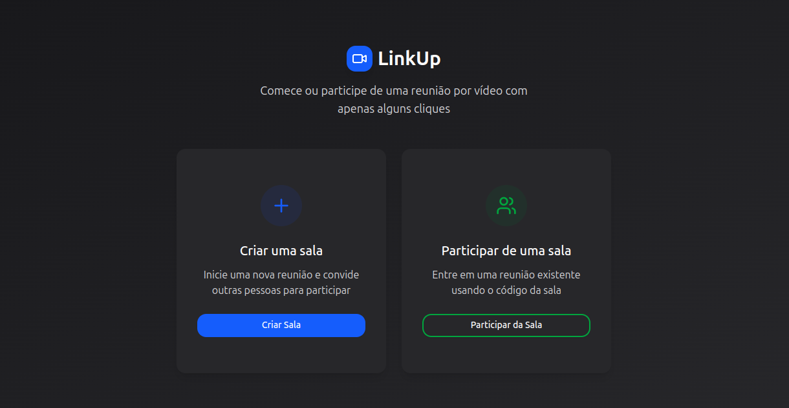

# 🚀 LinkUp

LinkUp é uma aplicação de videoconferência em tempo real que permite aos usuários criar e participar de salas de reunião virtuais de forma simples e rápida.



## ✨ Principais Tecnologias

- **Gerenciador de Pacotes:** [pnpm](https://pnpm.io/)
- **Estrutura:** Monorepo
- **Aplicação Web:**
  - **Framework:** [Next.js 15](https://nextjs.org/) (com App Router)
  - **Linguagem:** [TypeScript](https://www.typescriptlang.org/)
  - **Estilização:** [Tailwind CSS 4](https://tailwindcss.com/)
  - **Componentes UI:** [shadcn/ui](https://ui.shadcn.com/)
  - **Ícones:** [Lucide React](https://lucide.dev/)

## 📂 Estrutura do Projeto

Este é um monorepo que contém as seguintes aplicações:

- `apps/web`: A aplicação principal do front-end construída com Next.js.

## 🛠️ Como Executar o Projeto

Siga os passos abaixo para executar a aplicação em seu ambiente de desenvolvimento.

**Pré-requisitos:**

- Node.js (versão 20 ou superior)
- [pnpm](https://pnpm.io/installation)

1.  **Clone o repositório:**

    ```bash
    git clone https://github.com/joserochadev/link-up.git
    cd link-up
    ```

2.  **Instale as dependências:**
    A partir da raiz do projeto, execute o comando abaixo para instalar as dependências de todas as aplicações no monorepo.

    ```bash
    pnpm install
    ```

3.  **Inicie o servidor de desenvolvimento:**
    Este comando irá iniciar a aplicação web (`apps/web`) usando o Turbopack.

    ```bash
    pnpm dev
    ```

4.  **Acesse a aplicação:**
    Abra seu navegador e acesse [http://localhost:3000](http://localhost:3000) para ver o resultado.
